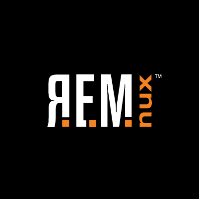

# REMnux Documentation

This site provides  documentation for [REMnux](https://REMnux.org), a Linux toolkit for reverse-engineering and analyzing malware. REMnux strives to make it easier for forensic investigators and incident responders to start using the variety of freely-available tools that can examine malware, yet might be difficult to find or set up.

The heart of the project is the [REMnux Linux distribution](distro/get.md) based on Ubuntu This lightweight distro incorporates many tools for analyzing Windows and Linux malware, examining browser-based threats such as obfuscated JavaScript, exploring suspicious document files and taking apart other malicious artifacts. Investigators can also use the distro to intercept suspicious network traffic in an isolated lab when performing behavioral malware analysis.

Another REMnux initiative involves building Docker [images of popular malware analysis tools](containers/about.md). The goals of this effort is to allow investigators to conveniently utilize difficult-to-setup applications without having to install the REMnux distro. You can run Dockerized application containers as part of your existing environment.

REMnux is maintained by [Lenny Zeltser](http://zeltser.com) with extensive help from [David Westcott](https://twitter.com/beast_fighter). You can learn the malware analysis techniques that make use of the tools installed and pre-configured on the REMnux distro by taking [Reverse-Engineering Malware training](http://www.sans.org/course/reverse-engineering-malware-malware-analysis-tools-techniques) at SANS Institute.
